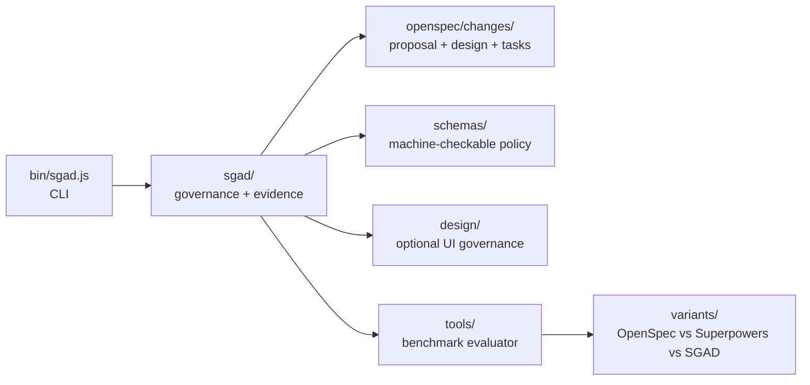
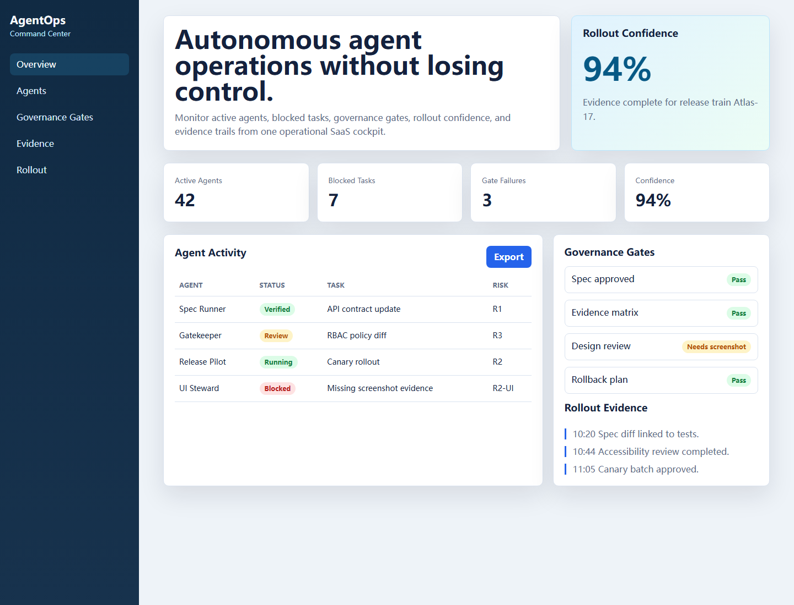
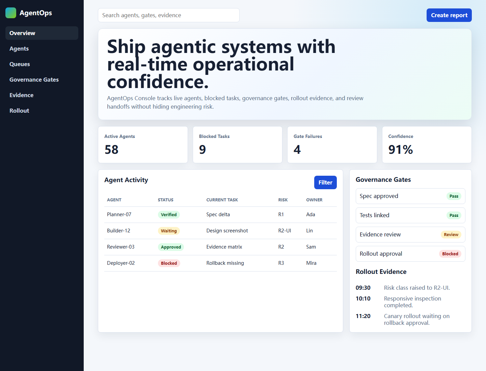
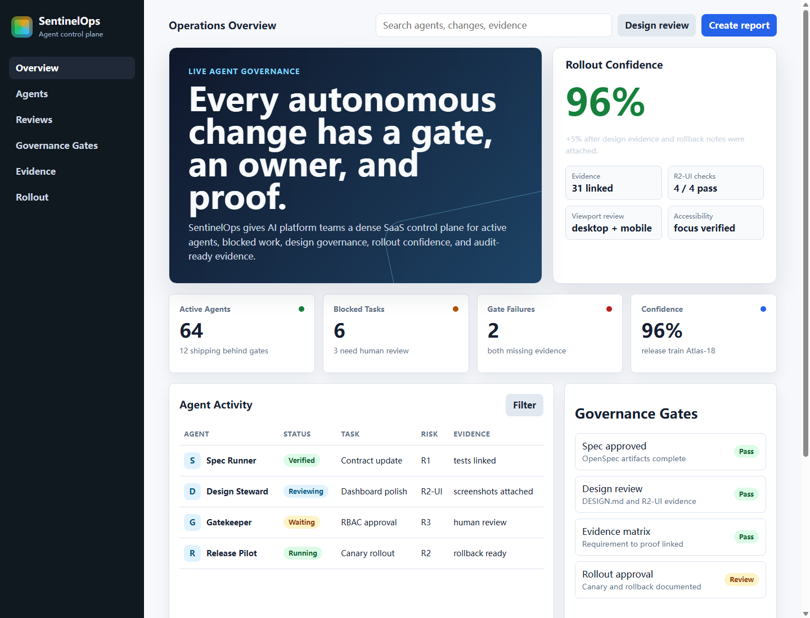

<p align="center">
  
</p>

**Spec-Governed Agentic Development: a practical governance layer for AI coding agents.**

SGAD combines spec-driven development, agent execution discipline, TDD, and production governance. It is designed for teams that want AI agents to move fast without losing requirements, tests, risk review, rollout gates, and evidence.

<p align="center">
  <a href="README.zh-CN.md">Chinese</a> |
  <a href="docs/getting-started.md">Getting Started</a> |
  <a href="docs/sgad-v2.md">Spec</a> |
  <a href="docs/evaluation.md">Evaluation</a> |
  <a href="docs/design-governance.md">Design Track</a> |
  <a href="docs/experience-layer.md">Experience Layer</a>
</p>

<p align="center">
  <strong>OpenSpec-style specs</strong> + <strong>Superpowers-style execution</strong> + <strong>governance-as-code</strong> + <strong>evidence</strong>
</p>


## Why It Exists

OpenSpec is strong at structured change proposals and specs.

Superpowers is strong at disciplined agent execution.

SGAD adds the missing production engineering layer:

- risk classification
- autonomy budgets
- evidence matrices
- rollout gates
- human approval policy
- requirement-to-test-to-risk traceability
- optional design governance for AI-generated UI


## Quickstart

Run the benchmark:

```bash
git clone https://github.com/MadPrinter/sgad.git
cd sgad
npm run evaluate
```

Use SGAD in another project:

```bash
npm link
cd your-project
sgad init
sgad check
```

Use it with an AI agent:

```text
Use SGAD for this change. Classify risk, create or update openspec/changes/<change-id>,
write tests, fill sgad/evidence-matrix.md or sgad/waivers.yaml, and run sgad check before final response.
```

## Core Model

```text
SGAD = Spec Layer + Execution Layer + Governance Layer + Evidence Layer

Spec Layer       = proposal, design, specs, tasks
Execution Layer  = plan, TDD, implementation, review, verification
Governance Layer = risk class, policies, autonomy budget, rollout gates
Evidence Layer   = requirement -> design -> task -> test -> risk -> proof

Optional Tracks = Design, Security, Data, Release
```

## Risk Classes

| Class | Scope | Required Process |
|---|---|---|
| R0 | copy, docs, tiny config | task + verification |
| R1 | single-module feature | spec + tasks + tests |
| R2 | API, DB, background jobs, external side effects | full SGAD workflow |
| R3 | auth, RBAC, payment, deletion, compliance | full SGAD + human approval + rollout gates |

## What Ships In This Repo



```text
bin/sgad.js                  portable CLI
plugins/sgad/                Codex-compatible plugin skeleton
schemas/                     machine-checkable governance schemas
docs/                        English documentation
docs/zh-CN/                  Chinese documentation
variants/openspec/           OpenSpec-style implementation
variants/superpowers/        Superpowers-style implementation
variants/sgad/               SGAD implementation
tools/                       evaluator and scoring scripts
```

## Real Experiment

The repository includes a runnable medium-sized benchmark: **Incident Response Center**.

All three variants implement the same system:

- REST API
- static frontend
- multi-tenant isolation
- RBAC
- incident status workflow
- audit log
- SLA reminder background job
- injectable notifier
- tests
- workflow-specific documentation

Final score:

| Variant | Score | Tests |
|---|---:|---:|
| OpenSpec | 83/100 | 5 passing |
| Superpowers | 78/100 | 6 passing |
| SGAD v2 | 95/100 | 6 passing |

See [EXPERIMENT_REPORT.md](EXPERIMENT_REPORT.md) and [RESULTS.json](RESULTS.json).

## SaaS Page Experiment

SGAD v0.3 also includes a UI-heavy experiment: three workflows build the same polished AI Ops SaaS dashboard.

```bash
npm run evaluate:saas
```

Open the pages:

```text
experiments/saas-page/compare.html
experiments/saas-page/variants/openspec/public/index.html
experiments/saas-page/variants/superpowers/public/index.html
experiments/saas-page/variants/sgad/public/index.html
```

Open `experiments/saas-page/compare.html` for the side-by-side visual comparison.

| Variant | Score | Percent |
|---|---:|---:|
| OpenSpec | 95/110 | 86% |
| Superpowers | 95/110 | 86% |
| SGAD v0.3 | 105/110 | 95% |

### Visual Output

| OpenSpec | Superpowers | SGAD v0.3 |
|---|---|---|
| [](experiments/saas-page/variants/openspec/public/index.html) | [](experiments/saas-page/variants/superpowers/public/index.html) | [](experiments/saas-page/variants/sgad/public/index.html) |

See [experiments/saas-page/REPORT.md](experiments/saas-page/REPORT.md).

## Commands

```bash
npm run evaluate        # run all variants and score them
npm run evaluate:saas   # run the UI-heavy SaaS page experiment
npm run check           # run SGAD checks plus full evaluation
npm run test:sgad       # run SGAD variant tests
sgad init               # scaffold SGAD in the current project
sgad init --with-design # scaffold SGAD plus optional UI design governance
sgad init --with-experience # scaffold SGAD plus optional agent experience governance
sgad check              # verify required governance artifacts
sgad check --json       # emit machine-readable issues and warnings for CI or agents
sgad experience recall --json # recall bounded project experience summaries
sgad experience audit --json  # validate project experience artifacts
```

## Evidence Closure

For R2/R3 work, `sgad check` verifies that evidence rows are closed, not merely present. Naked `pending`, `TBD`, empty,
or placeholder evidence fails unless a matching unexpired waiver exists in `sgad/waivers.yaml`.

```yaml
evidence:
  allow_pending: false
  pending_max: 0
  require_evidence_paths: true
```

Concrete evidence should point at repository paths, test paths, globs, URLs, or recognized external artifacts such as
`uat:<id>`. Use waivers only for time-boxed exceptions:

```yaml
waivers:
  - requirement: REQ-003
    reason: "UAT blocked on schedule; automated dry-run passed"
    expires: 2026-06-15
    approved_by: human
    evidence_partial: tests/test_smtp_reply.py
```

## Experience Layer

SGAD can keep project-local agent experience without injecting history by default. Reusable lessons live under
`sgad/experience/`, stay scoped to files or task types, and require evidence before active recall.

```bash
sgad experience recall --query "evidence gate" --files "bin/sgad.js" --limit 3 --json
sgad experience template --title "Evidence gate lesson" --change "<change-id>" --files "bin/sgad.js" --json
sgad experience audit --json
```

Recall returns only bounded summaries from active, scoped, evidence-backed lessons. Raw traces and long episodes remain
audit material unless explicitly requested. New lessons start as review-queue candidates and do not affect recall until
they are promoted to `active` with scope, triggers, and evidence.

## Optional Design Track

SGAD now supports an optional Design Governance Track inspired by `DESIGN.md` libraries such as `awesome-design-md`.

It is enabled only for UI-impacting work:

```bash
sgad init --with-design
```

This creates:

```text
design/DESIGN.md
design/components.md
design/screenshots/
sgad/design-review.md
```

See [docs/design-governance.md](docs/design-governance.md).

Run the SGAD sample app:

```bash
cd variants/sgad
node --test
node src/server.js
```

Open:

```text
http://localhost:3000
```

## Agent Support

SGAD is agent-neutral. It can be used with Codex, Claude Code, Cursor, OpenCode, Gemini CLI, GitHub Copilot CLI, or any assistant that can read repository files.

The repo includes:

- `CLAUDE.md` — auto-read project instructions for **Claude Code**
- `.claude/skills/sgad/SKILL.md` — Claude Code skill, invocable via `/sgad`
- `plugins/sgad/skills/sgad/SKILL.md` — portable plugin skeleton
- `.codex/skills/sgad/SKILL.md` — generated Codex skill via `sgad init`
- CLI commands that map cleanly to slash-command adapters

See [docs/integrations.md](docs/integrations.md).

## Version

Current version: `v0.3.0`

See [CHANGELOG.md](CHANGELOG.md).
