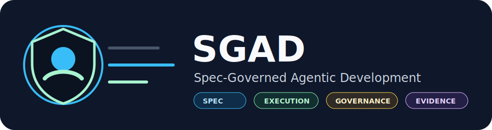
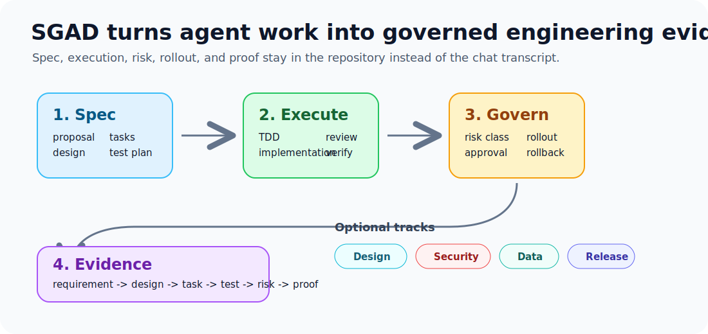
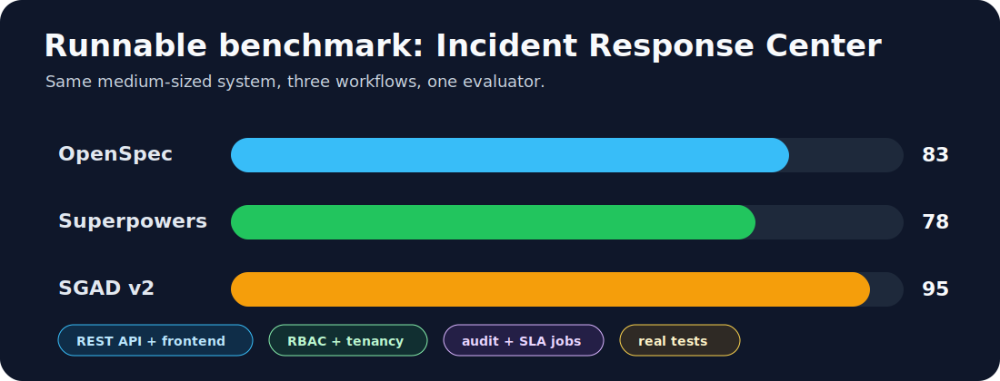
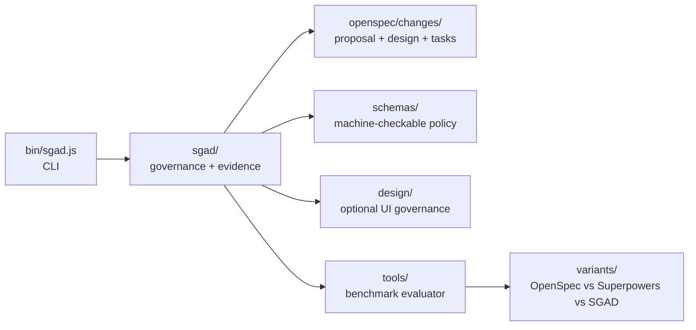

<p align="center">
  
</p>

**Spec-Governed Agentic Development：面向 AI 编程 Agent 的工程治理层。**

SGAD 融合规格驱动开发、Agent 执行纪律、TDD 和生产工程治理。它面向那些希望 AI Agent 快速推进、但又不想丢掉需求、测试、风险评审、发布门禁和证据的团队。

[English](README.md) | [快速开始](docs/zh-CN/getting-started.md) | [规范](docs/zh-CN/sgad-v2.md) | [评估](docs/zh-CN/evaluation.md) | [竞品分析](docs/zh-CN/competitive-analysis.md)

<p align="center">
  <strong>OpenSpec 风格规格</strong> + <strong>Superpowers 风格执行</strong> + <strong>governance-as-code</strong> + <strong>证据矩阵</strong>
</p>



## 为什么需要它

OpenSpec 擅长结构化变更提案和规格管理。

Superpowers 擅长约束 Agent 的执行纪律。

SGAD 补上生产工程里最容易缺失的一层：

- 风险分级
- 自主性预算
- 证据矩阵
- 发布门禁
- 人工审批策略
- 需求到测试到风险的可追溯性
- 面向 AI 生成 UI 的可选设计治理



## 快速开始

运行 benchmark：

```bash
git clone https://github.com/MadPrinter/sgad.git
cd sgad
npm run evaluate
```

在另一个项目中使用 SGAD：

```bash
npm link
cd your-project
sgad init
sgad check
```

给 AI Agent 的提示词：

```text
Use SGAD for this change. Classify risk, create or update openspec/changes/<change-id>,
write tests, update sgad/evidence-matrix.md, and run sgad check before final response.
```

## 核心模型

```text
SGAD = 规格层 + 执行层 + 治理层 + 证据层

规格层 = proposal, design, specs, tasks
执行层 = plan, TDD, implementation, review, verification
治理层 = risk class, policies, autonomy budget, rollout gates
证据层 = requirement -> design -> task -> test -> risk -> proof

可选轨道 = Design, Security, Data, Release
```

## 风险分级

| 级别 | 范围 | 必需流程 |
|---|---|---|
| R0 | 文案、文档、小配置 | task + verification |
| R1 | 单模块普通功能 | spec + tasks + tests |
| R2 | API、数据库、后台任务、外部副作用 | 完整 SGAD 流程 |
| R3 | 认证、RBAC、支付、删除、合规 | 完整 SGAD + 人工审批 + 发布门禁 |

## 仓库包含什么



```text
bin/sgad.js                  可移植 CLI
plugins/sgad/                Codex 兼容插件骨架
schemas/                     可机器检查的治理 schema
docs/                        英文文档
docs/zh-CN/                  中文文档
variants/openspec/           OpenSpec 风格实现
variants/superpowers/        Superpowers 风格实现
variants/sgad/               SGAD 实现
tools/                       评估和打分脚本
```

## 真实实验

仓库包含一个可运行的中型 benchmark：**Incident Response Center**。

三种方案都实现同一个系统：

- REST API
- 静态前端
- 多租户隔离
- RBAC
- incident 状态流转
- 审计日志
- SLA reminder 后台任务
- injectable notifier
- 测试
- 各自工作流要求的文档产物

最终评分：

| 方案 | 分数 | 测试 |
|---|---:|---:|
| OpenSpec | 83/100 | 5 个通过 |
| Superpowers | 78/100 | 6 个通过 |
| SGAD v2 | 95/100 | 6 个通过 |

详见 [EXPERIMENT_REPORT.md](EXPERIMENT_REPORT.md) 和 [RESULTS.json](RESULTS.json)。

## 命令

```bash
npm run evaluate        # 运行全部方案并打分
npm run check           # 运行 SGAD 检查和完整评估
npm run test:sgad       # 运行 SGAD 方案测试
sgad init               # 在当前项目生成 SGAD 治理文件
sgad init --with-design # 生成 SGAD，并启用可选 UI 设计治理
sgad check              # 检查必需治理产物
```

## 可选 Design Track

SGAD 现在支持可选 Design Governance Track，借鉴 `awesome-design-md` 这类 `DESIGN.md` 规范库，但不是强制第五层。

只有涉及 UI 的工作才启用：

```bash
sgad init --with-design
```

它会生成：

```text
design/DESIGN.md
design/components.md
design/screenshots/
sgad/design-review.md
```

详见 [docs/zh-CN/design-governance.md](docs/zh-CN/design-governance.md)。

运行 SGAD 示例应用：

```bash
cd variants/sgad
node --test
node src/server.js
```

打开：

```text
http://localhost:3000
```

## Agent 支持

SGAD 不绑定具体 Agent。Codex、Claude Code、Cursor、OpenCode、Gemini CLI、GitHub Copilot CLI，或者任何能读写仓库文件的助手都能使用。

仓库已经包含：

- `plugins/sgad/skills/sgad/SKILL.md`
- `sgad init` 会生成的 `.codex/skills/sgad/SKILL.md`
- 可以映射到 slash command adapter 的 CLI 命令

详见 [docs/integrations.md](docs/integrations.md)。

## 版本

当前版本：`v0.3.0`

详见 [CHANGELOG.md](CHANGELOG.md)。
